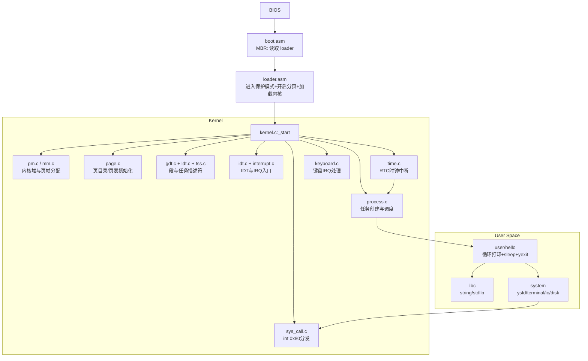
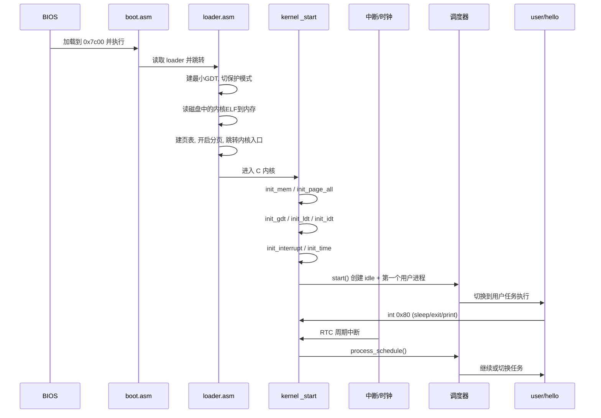

# YOS 整体架构与流程图

本文用于快速恢复项目全貌，回答三个问题：
- 系统如何从 BIOS 启动到用户程序
- 各模块如何协作
- 当前实现已经覆盖到哪里

## 1. 分层架构

## 2. 启动主流程（时序）

## 3. 模块职责对照

- 启动与装载
  - boot.asm: BIOS 阶段读取 loader。
  - loader.asm: 切保护模式、开分页、加载 ELF 内核并跳转。
- 内存
  - pm.c: 内核堆分配器（ktrunk 链式块）、页帧分配。
  - page.c: 初始化页目录/页表，建立用户/内核空间映射。
- CPU 描述符与任务切换
  - gdt.c / ldt.c / tss.c: 段描述符、LDT、TSS 构造与安装。
- 中断与时钟
  - idt.c / interrupt.c / idt0.asm: IDT 表项、PIC 初始化、汇编中断封装。
  - time.c: RTC 周期中断、tick 计数、唤醒与调度触发。
- 进程与系统调用
  - process.c: 双向循环链表任务管理、round-robin 调度、ELF 用户程序装载。
  - sys_call.c: int 0x80 分发（print/exit/sleep）。
- 用户态与系统库
  - user/hello.c: 演示 sleep 与退出。
  - system/src/ystd: ysleep/yexit 对 int 0x80 的用户态封装。

## 4. 当前已实现能力

- 已打通最小闭环
  - 启动链路：BIOS -> boot -> loader -> kernel。
  - 保护模式与分页初始化。
  - GDT/IDT/LDT/TSS 基本可用。
  - 时钟中断、键盘中断、系统调用中断。
  - 任务创建与基本轮转调度。
  - 从磁盘加载用户 ELF 并执行。
  - 用户态调用 sleep/exit/print 的最小系统调用链路。

- 当前边界
  - sleep 目前是“内核同步等待 + hlt”路径，可用但不是完整阻塞队列模型。
  - 进程调度策略较简单（无优先级、无时间统计、公平性机制简单）。
  - 尚无完整文件系统、网络协议栈、线程模型、统一设备模型。

## 5. 镜像布局（构建产物）

- kernel/Makefile 将镜像写入 disk.img：
  - 扇区 0: boot.bin
  - 扇区 1-2: loader.bin
  - 扇区 3 开始: yos.bin
  - 扇区 1000 开始: user/hello

这个布局与 process.c 里从扇区 1000 读取用户程序的逻辑一致。
